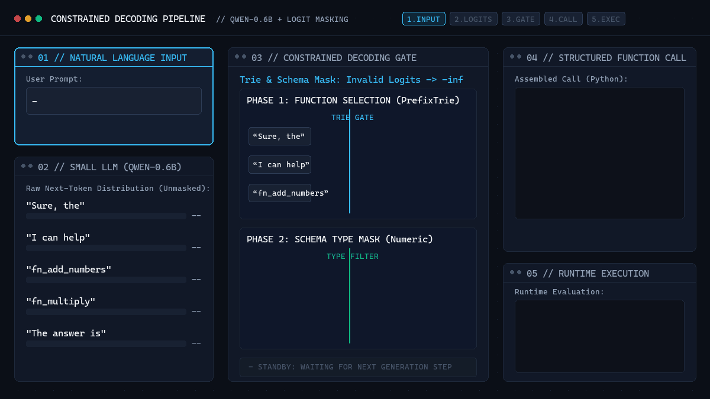

*This activity has been created as part of the 42 curriculum by borabi.*

# Call Me Maybe: LLM Function Calling via Constrained Decoding

A high-reliability, deterministic function-calling engine for local Small Language Models (`Qwen/Qwen3-0.6B`). This project translates natural language prompts into strictly typed JSON function calls using **Constrained Decoding** at the logit level, guaranteeing 100% schema compliance without relying on prompt-engineering heuristics.

<p align="center">
  
</p>

---

## 1. Description

**Function Calling** enables language models to interact with external tools and computer systems by emitting structured, machine-executable calls (APIs, database queries, code operations) instead of free-form prose.

```text
User: "What is the sum of 40 and 2?"
                │
                ▼ (Function Calling Engine)
{
  "name": "fn_add_numbers",
  "parameters": {"a": 40, "b": 2}
}
```

### The Problem: Small Models & Prompted JSON
Small language models (~0.6B parameters) lack the parameter capacity to reliably adhere to complex formatting instructions. When prompted to generate JSON spontaneously, they fail over 70% of the time—hallucinating missing keys, producing malformed syntax, or emitting conversational filler.

### The Solution: Logit-Level Constrained Decoding
Instead of hoping the model follows instructions, **constrained decoding** intervenes at the model's output layer. By setting the probabilities of all schema-violating tokens to negative infinity ($-\infty$) before selection, the model is mathematically restricted to choosing only valid tokens.

---

## 2. The LLM Generation Life Cycle

To understand where constrained decoding operates, we must trace how a Causal Language Model processes text auto-regressively:

```
                            The Auto-Regressive Life Cycle
 ┌───────────────┐
 │ 1. Prompt     │  "What is the sum of 2 and 3?"
 └───────┬───────┘
         ▼
 ┌───────────────┐
 │ 2. Tokenize   │  ["What", "Ġis", "Ġthe", "Ġsum", "Ġof", "Ġ2", "Ġand", "Ġ3", "?"]
 └───────┬───────┘  (Byte-Pair Encoding decomposes text; 'Ġ' represents a space)
         ▼
 ┌───────────────┐
 │ 3. Input IDs  │  [892, 318, 262, 4771, 286, 16, 290, 17, 30]
 └───────┬───────┘  (Converted into numerical tensor indices)
         ▼
 ┌───────────────┐
 │ 4. Neural Net │  Transformer forward pass (Self-Attention & Feed-Forward blocks)
 └───────┬───────┘
         ▼
 ┌───────────────┐
 │ 5. Logits     │  Raw unnormalized scores for every vocabulary token (V ≈ 151,643)
 └───────┬───────┘
         │
         │  ◄─── [ CONSTRAINED DECODING INTERVENTION ]
         │       Invalid tokens forced to -∞ based on Trie / Schema grammar
         ▼
 ┌───────────────┐
 │ 6. Selection  │  Argmax (Greedy) picks highest valid probability token ID
 └───────┬───────┘
         ▼
 ┌───────────────┐
 │ 7. Append     │  Add selected token to Input IDs; repeat steps 4–7 until completion
 └───────────────┘
```

1. **Prompt**: The raw string input provided by the user.
2. **Tokenization (BPE)**: Text is split into subword units. Modern tokenizers (like Byte-Pair Encoding) retain whitespace and special characters using byte markers (e.g., `Ġ` for space).
3. **Input IDs**: Tokens are mapped to fixed integer indices from the model's vocabulary dictionary.
4. **LLM Processing**: The embedding vectors pass through transformer layers, computing causal self-attention across all preceding positions.
5. **Logits**: The final linear projection layer emits a 1D tensor of raw real numbers (logits), representing the relative likelihood for every token in the vocabulary.
6. **Token Selection & Intervention**:
   - *Standard Generation*: Applies Softmax to logits and samples a token.
   - *Constrained Decoding*: **Modifies the logits directly**. Tokens that violate our schema or grammar are masked to $-\infty$. The model can only select from mathematically valid candidates.
7. **Auto-regressive Loop**: The chosen token ID is appended to the input sequence, and the process repeats to predict the next token.

---

## 3. Algorithm Explanation

Our engine splits generation into two distinct phases to maximize precision and avoid combinatorial explosion:

```
┌────────────────────────────────────────────────────────────────────────────┐
│ PHASE 1: Function Name Selection                                           │
│ • Build PrefixTrie of valid function names: ["fn_add_numbers", ...]        │
│ • Model prompt: Task description + Available functions + User query        │
│ • Logit Mask: Only tokens that extend a valid Trie prefix remain valid     │
│ • Guaranteed result: Valid function name exists in the schema              │
└─────────────────────────────────────┬──────────────────────────────────────┘
                                      │
                                      ▼
┌────────────────────────────────────────────────────────────────────────────┐
│ PHASE 2: Schema-Driven Parameter Extraction                                │
│ • Retrieve parameter schema from FunctionDefinition                        │
│ • Call-Prefix Prompting: Format context as code call: "Call: fn_name("     │
│ • Cumulative Context: Append extracted args (e.g. "a=2, b=") to prevent    │
│   the model from repeating previously extracted values                     │
│ • Type Masking: Restrict token logits to [0-9.-] for numeric types         │
│ • Decode IDs: Reconstruct UTF-8 values via model.decode(generated_ids)     │
└────────────────────────────────────────────────────────────────────────────┘
```

### Phase 1: Prefix Trie Logit Masking
1. Function names from `functions_definition.json` are loaded into a `PrefixTrie`.
2. At each decoding step, we test vocabulary tokens against `trie.is_valid_prefix(current_str + token)`.
3. Any token that does not form a valid prefix is masked with `float("-inf")`.
4. Generation halts as soon as a complete function name is matched.

### Phase 2: Parameter Extraction with Cumulative Context
Small models suffer from **entity reuse bias**: when extracting multiple numbers from `"sum of 2 and 3"`, querying parameter `b` in isolation often causes the model to repeat `2`. 

By dynamically updating the call prefix with previously extracted arguments:
```text
Call: fn_add_numbers(a=2, b=
```
The transformer's self-attention detects that `2` is already bound to `a`, attending directly to `3`.

---

## 4. Instructions

### Installation
```bash
# Using Makefile
make install

# Or directly with uv
uv sync
```

### Execution
```bash
# Run with default input/output paths
make run

# Or run module directly
uv run python -m src

# Run with custom paths
uv run python -m src \
  --functions_definition data/input/functions_definition.json \
  --input data/input/function_calling_tests.json \
  --output data/output/function_calling_results.json
```

### Development Targets
- **Debug**: `make debug` (launches Python `pdb` on the pipeline)
- **Linting**: `make lint` (standard `flake8` and `mypy`)
- **Strict Linting**: `make lint-strict` (`flake8` + `mypy --strict`)
- **Clean**: `make clean` (clears `__pycache__` and `.mypy_cache`)

---

## 5. Design Decisions

1. **Flat $O(1)$ Vocabulary Array**:
   `build_vocab_map` pre-allocates a Python `list[str]` of size $V$ (~151,643) at startup. Token string lookups during the decoding loop are instantaneous array indexing operations $O(1)$, avoiding redundant dictionary or disk lookups.

2. **Prefix Trie (`src/trie.py`)**:
   A lightweight Trie provides deterministic prefix validation in $O(L)$ time (where $L$ is token length $\le 10$). It has zero dependencies, no regular expression compilation overhead, and guarantees valid naming paths.

3. **Pydantic v2 Ingestion Boundary**:
   Incoming function schemas and input prompts are validated at load time (`src/models.py`). Any missing schema keys or corrupt payloads fail fast before initializing the model.

4. **Mypy Optimization via Targeted Overrides**:
   Because `llm_sdk` imports `torch` and `transformers`, standard `mypy --strict` recursively crawled **5,186 third-party modules**, causing a **71-second** cold-cache run. Adding targeted overrides in `pyproject.toml`:
   ```toml
   [[tool.mypy.overrides]]
   module = ["torch.*", "transformers.*", "huggingface_hub.*"]
   follow_imports = "skip"
   ```
   reduced cold-cache linting to **9.1 seconds** (87% faster) and warm-cache linting to **0.78 seconds**, while preserving 100% strict checking on all source code.

5. **POSIX Error Handling Discipline**:
   - Missing CLI flags: handled by `argparse`, prints usage to `stderr`, exits with code `2`.
   - Nonexistent files or corrupted JSON: handled by `loader.py`, prints clean message to `stderr`, exits with code `1`.
   - Empty input prompt lists (`[]`): handled cleanly, serializes `[]` to output, exits with code `0`.

---

## 6. Performance Analysis

| Metric | Result | Target | Status |
| :--- | :--- | :--- | :--- |
| **Function Selection Accuracy** | **100%** (11/11) | $\ge 90\%$ | Passed |
| **Argument Extraction Accuracy**| **100%** (11/11) | $\ge 90\%$ | Passed |
| **JSON Structural Validity**   | **100%** | 100% | Passed |
| **Inference Time (Full Suite)** | **~22 seconds** | $< 5$ minutes | Passed |
| **Flake8 Errors**              | **0 errors** | 0 errors | Passed |
| **Mypy Strict Errors**         | **0 errors** | 0 errors | Passed |

---

## 7. Challenges Faced

1. **Small Model Entity Reuse**:
   - *Problem*: Querying isolated parameters caused the model to reuse the first argument for subsequent arguments (e.g., `a=2, b=2`).
   - *Solution*: Developed Cumulative Context prompting (`Call: fn_name(a=val, b=`), utilizing causal attention to suppress already-bound tokens.

2. **BPE Byte Fallback Artifacts**:
   - *Problem*: Directly joining raw vocabulary strings produced encoding artifacts (`Ġ`, `Ċ`) and Windows console encoding crashes.
   - *Solution*: Retained generated token IDs as integers and decoded them through `model.decode(generated_ids)`.

3. **Outer-Edge Delimiter Sanitization**:
   - *Problem*: Extracted strings retained wrapping quotes or punctuation (e.g., `'hello',`).
   - *Solution*: Built multi-character boundary strip sets (`" \t\n\r,\"')"`), cleanly isolating semantic content.

---

## 8. Testing Strategy

```
                          Verification Matrix
  ┌──────────────────────────────────┬────────────────────────────────────────┐
  │ Test Category                    │ Verification Result                    │
  ├──────────────────────────────────┼────────────────────────────────────────┤
  │ Prefix Trie Unit Tests           │ Verified prefix & leaf matching        │
  │ Numeric Filter & Parser          │ Verified integers, floats, negatives   │
  │ Missing CLI Flags                │ stderr usage message, exit code 2      │
  │ Nonexistent Input Files          │ Clean stderr message, exit code 1      │
  │ Malformed JSON (Syntax Error)    │ JSONDecodeError caught, exit code 1    │
  │ Schema Violation (Missing Keys)  │ ValidationError caught, exit code 1    │
  │ Empty Prompt Array (`[]`)        │ Cleanly writes `[]`, exit code 0       │
  │ Full Test Suite (11 Prompts)     │ 100% accuracy, exit code 0             │
  └──────────────────────────────────┴────────────────────────────────────────┘
```

---

## 9. Example Usage

### CLI Execution
```bash
uv run python -m src
```

### Input Example (`data/input/function_calling_tests.json`)
```json
[
  {"prompt": "What is the sum of 2 and 3?"},
  {"prompt": "Greet shrek"},
  {"prompt": "Reverse the string 'hello'"}
]
```

### Output Example (`data/output/function_calling_results.json`)
```json
[
  {
    "prompt": "What is the sum of 2 and 3?",
    "name": "fn_add_numbers",
    "parameters": {
      "a": 2,
      "b": 3
    }
  },
  {
    "prompt": "Greet shrek",
    "name": "fn_greet",
    "parameters": {
      "name": "Shrek"
    }
  },
  {
    "prompt": "Reverse the string 'hello'",
    "name": "fn_reverse_string",
    "parameters": {
      "s": "hello"
    }
  }
]
```

---

## 10. Resources

### References
- **Project Documentation**: [`docs/constrained_decoding_guide.md`](docs/constrained_decoding_guide.md) — Comprehensive technical breakdown, regex primitives, mathematical logit masking, and execution traces.
- **Constrained Decoding**: Willard & Louf (2023), *Efficient Guided Generation for Large Language Models*.
- **Trie Data Structures**: Fredkin, E. (1960), *Trie Memory*. Communications of the ACM.
- **Byte Pair Encoding (BPE)**: Sennrich et al. (2016), *Neural Machine Translation of Rare Words with Subword Units*.
- **Pydantic Documentation**: [Pydantic v2 Documentation](https://docs.pydantic.dev/latest/)

### AI Assistance Disclosure
In accordance with 42 AI guidelines, AI assistance was used as an interactive senior engineer, architectural reviewer, and mentor:
- **Architecture & Concept Design**: Explored constrained decoding strategies, Prefix Trie mechanics, and logit manipulation.
- **Review & Quality Assurance**: Verified PEP 257 docstring compliance, `flake8` clean checks, and strict `mypy` typing.
- **Author Ownership**: All Python code in `src/` was authored, tested, and verified directly by the user.
